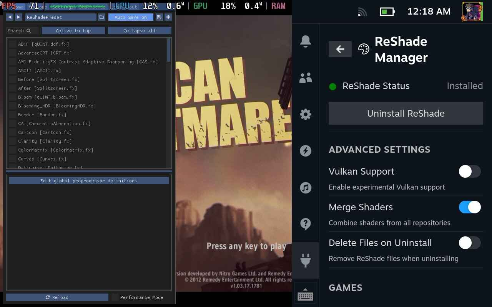

# LetMeReShade 🎮

[](https://github.com/SteamDeckHomebrew/decky-loader)
[](LICENSE)
[](https://github.com/itsOwen/LetMeReShade/releases)
[](https://store.steampowered.com/steamdeck)

> 🚀 **Ultimate Steam Deck Graphics Enhancement Suite** - Advanced shader customization with ReShade and VkBasalt support for next-level visual fidelity



## ✨ Features

### 🎨 **Dual Enhancement Engines**
- **ReShade** - Industry-standard post-processing for DirectX/OpenGL games
- **VkBasalt** - High-performance Vulkan-native shader pipeline

### 🛠️ **Core Functionality**
- ⚡ One-click installation and management
- 🎯 Automatic game detection and configuration
- 🔧 Manual DLL patching capabilities
- 🌐 Global preset management with custom shader support
- 🎮 In-game overlay accessible via **HOME** key
- ⚙️ Steam Deck–optimized configurations
- 🎪 Full support for Heroic Games (Epic Games, GOG, Amazon Games)

## 📋 Prerequisites

| Requirement | Description |
|-------------|-------------|
| 🔌 **Decky Loader** | Must be installed on your Steam Deck |
| 🌐 **Internet Connection** | Required for initial setup and shader downloads |
| 💾 **Storage Space** | 500MB+ recommended for shader libraries |
| 🖥️ **Compatible OS** | SteamOS or compatible variants (Bazzite/ChimeraOS) |

## 🚀 Installation

### 📦 ReShade Installation

1. **📥 Download Latest Release**
   ```bash
   # Navigate to releases and download the latest version
   ```

2. **📁 Extract and Install**
   ```bash
   # Extract files to: homebrew/plugins/<LetMeReShade-folder>
   ```

3. **🔄 System Restart**
   ```bash
   # Restart Steam Deck to complete installation
   ```

> ⚠️ **Important Note**: ReShade conflicts with FGMOD due to shared DLL files. Uninstall or unpatch one before enabling the other.

### ⚡ VkBasalt Installation

Automatic installation through the plugin interface - no manual configuration required.

## ⚙️ Configuration

### 🎨 VkBasalt Configuration

1. **📝 Configuration File Setup**
   
   Create or edit `~/.config/vkBasalt/vkBasalt.conf`:

   ```ini
   # Core Effects Configuration
   effects = cas:denoise

   # Path Configurations
   reshade_effect_paths = path here
   reshade_texture_paths = path here
   reshade_include_paths = path here

   # Effect Parameters
   [cas]
   sharpness = 0.65

   [denoise]
   radius = 2
   ```

2. **📂 Custom Shader Placement**

   | Engine | Shader Location |
   |--------|----------------|
   | **ReShade** | `~/.local/share/reshade/shaders/` |
   | **VkBasalt** | `~/.config/reshade/Shaders/` |

3. **🎛️ Adding Custom Effects**
   ```ini
   # Append custom shader names (without .fx extension)
   effects = your_custom_effect
   ```

## 🎮 Usage

### 🏁 Initial Setup

1. **🔍 Access Plugin Interface**
   - Open Quick Access Menu → Navigate to LetMeReShade

2. **🎯 Select Enhancement Engine**
   - **ReShade**: For DirectX/OpenGL titles
   - **VkBasalt**: For Vulkan-based games

3. **🎛️ In-Game Access**
   - Launch game → Press **HOME** key for overlay

### 🎨 Shader Management

| Action | Method |
|--------|--------|
| **Enable Effects** | Plugin interface toggle |
| **Adjust Settings** | In-game overlay (HOME key) |
| **Load Presets** | Global preset manager |
| **Custom Shaders** | Drop files in designated folders |

## 🔧 Manual Patching

### 📖 Stardew Valley Example

> 💡 **Use Case**: When automatic patching doesn't work out of the box

**Step-by-Step Process:**

1. **🔌 Plugin Installation**
   ```bash
   # Install latest LetMeReShade version
   ```

2. **🗑️ Clean Installation**
   ```bash
   # Uninstall Stardew Valley completely
   ```

3. **⚙️ Compatibility Configuration**
   ```
   Game Properties → Compatibility → Force Compatibility → Proton Experimental
   ```

4. **📥 Windows Version Install**
   ```bash
   # Reinstall game (Windows version will download)
   ```

5. **🎨 Manual Patch Application**
   ```
   LetMeReShade → Manual Patching → Select Game → Select DLL (OpenGL) → Apply Patch
   ```

6. **🎪 Additional Enhancements**
   ```bash
   # Download Fadedew preset → Place in Stardew Valley folder
   ```

## 🔧 Troubleshooting

> 📚 **Comprehensive Guide**: [LetMeReShade Complete Wiki Guide](https://github.com/itsOwen/LetMeReShade/wiki/LetMeReShade-Complete-Guide)

### 🚨 Common Issues & Solutions

| Issue | Solution |
|-------|----------|
| **🚫 Overlay Not Appearing** | • Verify DLL override selection<br>• Check Vulkan launch settings<br>• Confirm HOME key mapping<br>• Validate engine compatibility |
| **💥 Game Crashes on Launch** | • Try alternative DLL override<br>• Check shader compatibility<br>• Verify game support |
| **🐌 Performance Issues** | • Disable intensive shaders<br>• Update plugin version<br>• Verify shader repositories |

### 🔍 Advanced Troubleshooting

```bash
# Check log files
~/.local/share/Steam/logs/

# Verify installation
homebrew/plugins/LetMeReShade/

# Reset configuration
rm ~/.config/vkBasalt/vkBasalt.conf
```

## 📺 Video Guide

### New video Guide

[](https://youtu.be/RvPkeBeSgoQ)

### Old guide (still relevant)

[](https://youtu.be/4uTVz7deH6E)

*Click to watch the comprehensive setup and usage tutorial*

## 🤝 Contributing

We welcome community contributions! Here's how you can help:

### 🐛 **Bug Reports**
- Use GitHub Issues with detailed reproduction steps
- Include system specifications and error logs

### 💡 **Feature Requests**
- Propose new functionality via GitHub Discussions
- Provide use cases and implementation suggestions

### 🔧 **Pull Requests**
- Fork the repository and create feature branches
- Follow existing code style and documentation standards

### 🎨 **Shader Presets**
- Share custom presets with the community
- Include screenshots and compatibility notes

## 🔄 Automatic Updates

The plugin provides seamless updates for:

| Component | Update Method |
|-----------|---------------|
| **🎨 ReShade/VkBasalt** | Automatic version checking |
| **📚 Shader Repositories** | Background synchronization |
| **🔌 Plugin Core** | Integrated update system |

## ⚖️ License

This project is licensed under the **BSD-3-Clause License**.

```
Copyright (c) 2024 LetMeReShade Contributors
All rights reserved.
```

See the [LICENSE](LICENSE) file for complete terms and conditions.

## 🙏 Acknowledgments

### 👨‍💻 **Core Contributors**
- **ZigmA** - Project inspiration and extensive testing support
- **xXJSONDeruloXx** - Foundation framework from *Decky Framegen* plugin
- **kevinlekiller** - *reshade-steam-proton* repository integration
- **DadSchoorse** - VkBasalt repository and Vulkan expertise

### 🌟 **Community Support**
Special thanks to the Steam Deck homebrew community for continuous feedback and testing.

## 📞 Support & Help

### 🆘 **Getting Help**

1. **📖 Documentation First**
   - Review this README thoroughly
   - Check the [Wiki Guide](https://github.com/itsOwen/LetMeReShade/wiki/LetMeReShade-Complete-Guide)

2. **🔍 Search Existing Issues**
   - Browse [GitHub Issues](https://github.com/itsOwen/LetMeReShade/issues)
   - Check closed issues for solutions

3. **🆕 Report New Issues**
   - Provide detailed system information
   - Include reproduction steps
   - Attach relevant log files

### 📱 **Community Channels**
- **GitHub Discussions** - Feature requests and general discussion
- **GitHub Issues** - Bug reports and technical support

---

<div align="center">

**🎮 Made with ❤️ for the Steam Deck Community 🎮**

*Enhancing your gaming experience, one shader at a time*

</div>