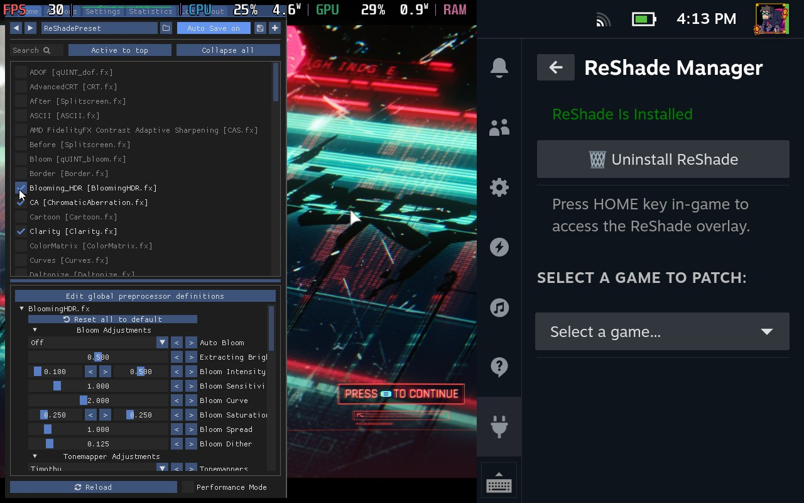

# LetMeReShade 🎮✨

[](https://github.com/SteamDeckHomebrew/decky-loader)
[](LICENSE)

> Ultimate Steam Deck graphics enhancement suite with advanced shader customization and Vulkan support via VkBasalt!



## 🌟 Features

- **Dual Enhancement Engines**
  - 🎨 **ReShade** (DirectX/OpenGL)
  - ⚡ **VkBasalt** (Vulkan)
- One-click installation and management
- Automatic game detection and configuration
- Manual DLL Patching
- Global preset management and custom shader support
- In-game overlay accessible via the **HOME** key
- Steam Deck–optimized configurations

## 📋 Prerequisites

- **Decky Loader** installed on your Steam Deck
- A stable internet connection (for initial setup and shader downloads)
- Adequate storage for shaders (500MB+ recommended)
- A SteamOS-based system (or compatible variants like Bazzite/ChamiraOS)

## 🚀 Installation

### ReShade Installation

1. **Download the Latest Release:**  
   Grab the latest version from the releases section.
2. **Extract Files:**  
   Unzip the archive and place the contents into `homebrew/plugins/<LetMeReShade-folder>`.
3. **Restart Your Steam Deck:**  
   This completes the installation.
4. **Note on Conflicts:**  
   ReShade conflicts with FGMOD (due to shared DLL files). To switch, uninstall or unpatch one before enabling the other.

### VkBasalt Configuration

1. **Configure VkBasalt:**  
   Edit (or create) the `vkBasalt.conf` file, usually located at `~/.config/vkBasalt/vkBasalt.conf`, with the following settings:
   ```conf
   # Enable effects (comma-separated)
   effects = cas:denoise

   # Path configurations
   reshade_effect_paths = path here
   reshade_texture_paths = path here
   reshade_include_paths = path here

   # Effect parameters
   [cas]
   sharpness = 0.65

   [denoise]
   radius = 2
   ```
2. **Custom Shader Placement:**  
   - **For ReShade:** Place `.fx` files in `~/.local/share/reshade/shaders/`.
   - **For VkBasalt:** Place `.fx` files in `~/.config/reshade/Shaders/`.
3. **Adding Custom Effects:**  
   Append your custom shader names (without the `.fx` extension) to the `effects` line:
   ```conf
   effects = your_custom_effect
   ```

## 📷 Video Guide

[](https://youtu.be/4uTVz7deH6E)

## 🎮 Usage

### Initial Setup

1. **Access the Plugin:**  
   Open the Quick Access Menu and navigate to the LetMeReShade plugin.
2. **Select Engine:**  
   Choose the appropriate installation based on your game:
   - Click **"Install ReShade"** for DirectX/OpenGL titles.
   - Click **"Install VkBasalt"** for Vulkan-based games.
3. **Overlay Access:**  
   Launch your game and press the **HOME** key to access the in-game overlay for shader adjustments.

## 🔧 Troubleshooting

### Common Issues

1. **Overlay Not Appearing**
   - Verify that the correct DLL override is selected (for ReShade) or that Vulkan launch settings are properly configured (for VkBasalt).
   - VkBasalt doesn't have a menu like ReShade.
   - Confirm the **HOME** key is correctly mapped.
   - Ensure that the game supports the selected enhancement engine.

2. **Game Crashes on Launch**
   - Try using an alternative DLL override (manual patching options coming soon).
   - Check shader compatibility and game support for ReShade or VkBasalt.

3. **Performance Issues**
   - Disable resource-intensive shaders.
   - Confirm you are running the latest version of the plugin and shader repositories.

## 📝 Contributing

We welcome contributions! Feel free to:
- Report bugs
- Suggest new features
- Submit pull requests
- Share shader presets

## 🔄 Updates

The plugin automatically checks for:
- ReShade and VkBasalt updates
- New shader repositories
- Plugin updates

## ⚖️ License

This project is licensed under the BSD-3-Clause License. See the [LICENSE](LICENSE) file for details.

## 🙏 Acknowledgments

- **ZigmA** for inspiring this plugin and assisting with testing.
- **xXJSONDeruloXx** for the *Decky Framegen* plugin, which laid the foundation for this project.
- **kevinlekiller** for the *reshade-steam-proton* repository.
- **DadSchoorse** for vkBasalt repository.

## 📞 Support

For assistance:
1. Review the troubleshooting guide.
2. Search existing issues.
3. Open a new issue if you need further help.

---

<p align="center">Made with ❤️ for the Steam Deck Community</p>